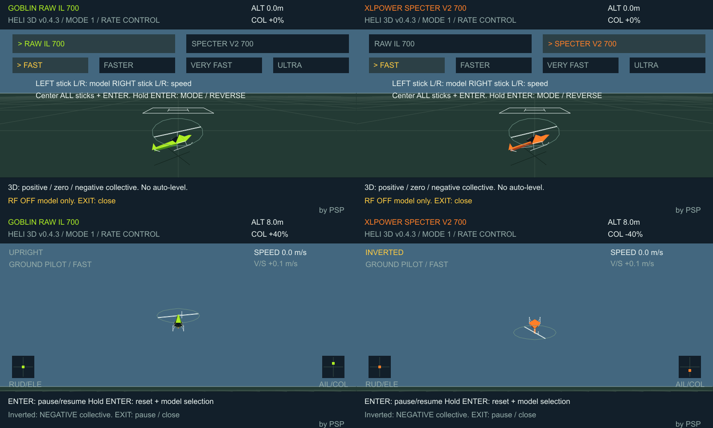

# PSP EdgeTX Heli 3D

TX16S MK3 / EdgeTX 2.12.2에서 실행하는 Lua RC 헬리콥터 시뮬레이터입니다.

**현재 버전: v0.4.3 · 제작자: PSP**

## 다운로드 / 설치

[설치 ZIP 다운로드](HELI3D-v0.4.3-SPEED-SOUND.zip)

1. ZIP을 풀고 `SD-CARD` 안의 `SCRIPTS` 폴더를 조종기 SD 카드 루트에 복사합니다.
2. 최종 경로는 `/SCRIPTS/TOOLS/HELI3D.lua`입니다. 업데이트라면 기존 파일을 덮어씁니다.
3. 실행 중인 스크립트를 종료한 후 **SYS → TOOLS → Heli 3D 700**을 실행합니다.
4. 화면 상단의 **v0.4.3**을 확인합니다.

내부·외부 RF를 모두 끈 시뮬레이터 전용 모델을 사용하세요. 이 스크립트는 RF 출력을 차단하거나 조종기 믹스를 변경하지 않습니다.

## 기능

- Goblin RAW IL 700 / XLPower Specter V2 700 스타일의 저폴리곤 기체
- MODE 1 / MODE 2 선택과 에일러론·엘리베이터·러더·콜렉티브 리버스
- 360도 롤·플립, 양/음 콜렉티브, 배면 비행
- 지상 조종자 시점과 거리에 따른 기체 크기 변화
- 지면 접촉 후 리셋 없이 재이륙
- 이동 범위·고도에 따른 정지 및 프레임 지연에 따른 자동 일시정지 없음
- 네 단계 속도 선택과 합성 로터 효과음 ON/OFF
- 화면 오른쪽 아래 `by PSP` 표시

## 시작과 설정

시작 화면에서 **왼쪽 스틱 좌우로 기체**, **오른쪽 스틱 좌우로 속도**를 선택합니다. 모든 스틱을 중앙에 놓고 ENTER를 누르면 지상에서 시작합니다.

시작 화면에서 **ENTER를 길게 누르면 설정**이 열립니다. 로터리 또는 +/−로 항목을 고르고 ENTER로 변경합니다.

| 설정 | 내용 |
| --- | --- |
| SIMULATOR MODE | MODE 1 / MODE 2 |
| RADIO ACTUAL MODE | 조종기 시스템의 실제 스틱 모드와 일치시키기. 지원 API가 있으면 자동 감지 |
| AILERON / ELEVATOR / RUDDER / COLLECTIVE | NORMAL / REVERSE |
| SOUND | ON / OFF |

스틱 소스를 직접 읽으므로 모델 채널의 출력 리버스 대신 위 리버스를 사용합니다. 설정은 실행 중에 유지되며 스크립트를 종료하면 초기화됩니다.

| 스틱 | MODE 1 | MODE 2 |
| --- | --- | --- |
| 왼쪽 상하 | 엘리베이터 | 콜렉티브 |
| 왼쪽 좌우 | 러더 | 러더 |
| 오른쪽 상하 | 콜렉티브 | 엘리베이터 |
| 오른쪽 좌우 | 에일러론 | 에일러론 |

콜렉티브 중앙은 **0피치**, 위는 양피치, 아래는 음피치입니다. 배면에서는 음피치로 고도를 유지합니다. 자동 수평 복귀는 없습니다.

## 속도

가장 느린 FAST가 이전 v0.4.1의 FAST와 같은 속도입니다. 배율은 회전 속도와 최대 추력 가속에 적용합니다.

| 단계 | 배율 | 최대 롤/플립 | 정상 정지 추력 COL |
| --- | --- | --- | --- |
| FAST | 1.0배 | 276°/s | 약 +31% |
| FASTER | 1.4배 | 약 386°/s | 약 +22% |
| VERY FAST | 1.8배 | 약 497°/s | 약 +17% |
| ULTRA | 2.2배 | 약 607°/s | 약 +14% |

비행 중 ENTER는 수동 일시정지/재개, ENTER 길게는 초기화 및 선택 화면 복귀입니다. EXIT는 비행 중 일시정지하고 정지 상태에서는 종료합니다.

자세한 설명은 [설치와 조작](설치와-조작.txt)을 참고하세요.

## 검증 및 한계

배포 Lua 원본을 Fengari Lua 5.3과 모의 EdgeTX API로 실행한 **94개 검사**가 통과했습니다. [검증 결과](검증결과.txt)를 제공합니다.

실제 TX16S MK3 및 EdgeTX Companion에서 실행하거나 소리를 청취한 검증은 아직 하지 않았습니다. 미리보기는 Lua 그리기 호출을 PC에서 재현한 것이며 실기 캡처가 아닙니다.

간이 비행 물리와 자체 제작 도형을 사용하며 두 기체의 물리는 동일합니다. 실제 공기역학·실속·엔진/RPM·오토로테이션을 정밀 재현하지 않습니다. 효과음은 실제 헬기 녹음이 아닌 합성 톤입니다. 제조사 공식 소프트웨어가 아닙니다.
